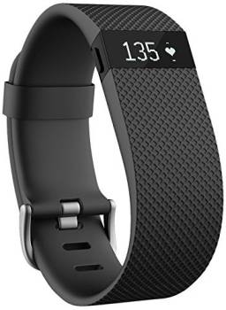

A pulseira *Fitbit** capitura a frequência cardíaca baseado na expansão e contração dos capilares na pele e faz essa medição com base na reflexão/absorção de luzes de LED, além de algorítimos de análise, diferentement do métudo usado monitor de frequência cardíaca **Polar H7**, que captura os sinais elétricos do batimento. Neste post, acessaremos uma `WebAPI` usando `OAuth2.0` para obter dados do **Fitbit** e compará-los com os obtidos por um **Polar H7**, importados de um arquivo GPX.

<!--more-->

## Introduction

Neste post vamos comparar aquisição de dados de frequência cardíaca realizado por dois dispositivos diferentes: uma pulseira *wearable* de esporte chamada **fitbit** e numa cinta de monitoramento cardíaco Polar.

### Devices

O modelo de pulseira utilizado foi o **[fitbit ChargeHR](https://www.fitbit.com/be/chargehr)**, que atualmente já não é mais comercializado. Para realizar a medição da frequência cardíaca **fitbit** uma tecnologia própria chama [PurePulse](https://www.fitbit.com/purepulse). When your heart beats, your capillaries expand and contract based on blood volume changes. PurePulse LEDs (light-emitting diodes) on your Fitbit device reflect onto the skin to detect blood volume changes, and finely-tuned algorithms are applied to measure heart rate automatically and continuously.



O monitor de frequencia cardíaca usado, foi o **[Polar H7 Heart Rate Sensor](https://www.polar.com/us-en/products/accessories/h10_heart_rate_sensor)**, que trabalha como um Eletro Cardiograma, ou seja, eletrodos em contato com a pele detectam o sinal elétrico disparado pelo coração a cada batida cardíaca.


Dessa maneira podemos comparar a qualidade e a precisão dos dados de frequência cardíaca obtidos com tecnologias bem diferentes.

## Data Acquisitions

Primeiro passo é obter os dados dos dispositivos, e para cada um usaremos uma estratégia diferente, para o **fitbit** faremos acesso aos dados via Web API, e para o **Polar H7** extrairemos do arquivo **GPX** do exercício.

### Fitbit

Para o **fitbit**, o acesso dos dados pode ser feita via [Web API](https://dev.fitbit.com/build/reference/web-api/) que utiliza [Oauth 2.0](https://oauth.net/2/) para autenticação d autorização, então é necessário obter [ID e Secret](https://www.oauth.com/oauth2-servers/client-registration/client-id-secret/) fazendo o cadastro no portal de desenvolvimento.

1. enter whatever you want for Application name and description
1. in the application website box, paste the URL of your google sheet from Step 1
1. for organization put “self”
1. for organization website put the URL of your google sheet from Step 1
1. for OAuth 2.0 Application Type select “Personal”
1. for Callback URL put in http://localhost:1410/
1. for Default Access Type select “Read Only”
1. click “save”

You should now be at a page that shows your

1. OAuth 2.0 Client ID
1. Client Secret

Com os parametros de acesso em mãos preencha um arquivo de configuração `fitbit_config.yml` (veja apendice) e estaremos prontos para obter os dados capturados do **fitbit** usando o `httr package`.

```{r loadingSettings, eval=FALSE, message=FALSE, warning=FALSE}

# loading ID and Secret 
# (see the post apendix)
library(yaml)
.config <- yaml.load_file("./config/fitbit_config.yml")

# performing authentication and autorization
library(httr)
fb_app   <- oauth_app(.config$app_name, .config$client_id, .config$client_secret)
fb_oauth <- oauth_endpoint(authorize = .config$auth_uri, access = .config$refresh_token_uri)
token    <- oauth2.0_token(fb_oauth, fb_app, scope = c("activity","heartrate","sleep"), cache = F, use_basic_auth = T)

```

As funções `oauth_app`, `oauth_endpoint` e `oauth2.0_token` executam o fluxo de autenticação e autorização do protocolo `OAuth 2.0` para obter o `Token`de acesso, que precisará ser passado para cada requisição feita à API do site do **fibtib**.

Podemos então fazer a chamada ao *[endpoint](https://dev.fitbit.com/build/reference/web-api/heart-rate/)* responsável pela consulta às informações de frequência cardíaca.

```{r heartRateEndPointFake, eval=FALSE, warning=FALSE, message=FALSE}

# request HR data
# Resource URL - There are two acceptable formats for retrieving time series data:
#
# GET https://api.fitbit.com/1/user/[user-id]/activities/heart/date/[date]/[period].json
# GET https://api.fitbit.com/1/user/[user-id]/activities/heart/date/[base-date]/[end-date].json
#
# user-id:   The encoded ID of the user. Use "-" (dash) for current logged-in user.
# base-date: The range start date, in the format yyyy-MM-dd or today.
# end-date:	 The end date of the range.
# date:	     The end date of the period specified in the format yyyy-MM-dd or today.
# period:	   The range for which data will be returned. Options are 1d, 7d, 30d, 1w, 1m.

# shortcut to define a url to get heart rate
library(glue)
gen_hr_url <- function(.user_id="-",.date="today",.period="1d")
  glue("https://api.fitbit.com/1/user/{.user_id}/activities/heart/date/{.date}/{.period}.json")


# make a HTTP GET 
# 2019-02-24 is the date of my MTB 
resp <- GET(gen_hr_url(.date="2019-02-24"), conf=config(token=token))

# check if the result is 200 (OK)
resp$status_code

```

```{r hbFitbitCache, echo=FALSE, cache=TRUE}

resp <- readRDS("./data/fitbit_http_resp.rds")
resp$status_code

```


Se tudo o ocorreu bem, a [requisição http](https://developer.mozilla.org/en-US/docs/Web/HTTP/Overview) devolveu [status 200](https://www.w3.org/Protocols/rfc2616/rfc2616-sec10.html), então podemos processar o [json](https://www.w3schools.com/js/js_json_intro.asp) do conteúdo da resposta para extrair os dados de frequencia cardíaca requisitada.

```{r fbJsonHandling, cache=TRUE, message=FALSE, warning=FALSE}

# process response content
library(jsonlite)
data <- fromJSON(content(resp, "text"))

# get the heart rate data 
# see the response json format in https://dev.fitbit.com/build/reference/web-api/heart-rate/ 
hrdt <- data$`activities-heart-intraday`$dataset

# convert the "text time data" in in date-time and create a tibble
library(tidyverse)
library(lubridate)
hrdt %>% 
  as.tibble() %>% 
  mutate( datetime = paste0("2019-02-24 ", time) ) %>% # adding "day" to time info
  mutate( datetime = ymd_hms(datetime) ) %>% 
  rename(fitbit_hr = value) %>% 
  select(datetime, fitbit_hr) -> fitbit_hr

# let's see we got
library(knitr)
library(kableExtra)
fitbit_hr %>% 
  head(10) %>% 
  kable() %>%
  kable_styling(bootstrap_options = "striped", full_width = F)
```

Os dados de frequência cardíaca do **fitbit** obtidos são medições minuto à minuto da taxa batimentos por minuto, é possível visualizar a frequência cardíaca ao longo do dia.

```{r fbHeartHate, cache=TRUE, message=FALSE, warning=FALSE}
# ploting HR x Datatime
fitbit_hr %>% 
  ggplot() +
  geom_line(aes(x=datetime, y=fitbit_hr, color=fitbit_hr)) +
  scale_color_gradient(name="heart rate (bpm)",low="green", high="red") +
  theme_minimal()
```

### Polar H7

Diferente do **fitbit** para obter os dados de frequência cardíaca do **Polar H7** o caminho mais fácil é puxar os dados da App ao qual ele estava sincronizado, na ocasião, usei a aplicação [Strava](https://www.strava.com/). Como fizemos no [post "Ploting your mtb track with r"]([https://yetanotheriteration.netlify.com/2018/01/ploting-your-mtb-track-with-r/]), iremos fazer o download do arquivo [GPX](https://en.wikipedia.org/wiki/GPS_Exchange_Format) contendo os dados registrados durante a sessão de exercício, direto do site da App, e processar o XML para extrar os dados que procuramos.

```{r loadGPX, cache=TRUE, message=FALSE, warning=FALSE}

# read gpx file
library(XML)
gpx_file <- htmlTreeParse("./data/Visconde_de_Sotello_e_Moenda.gpx", useInternalNodes = T)

# trackpoint XML  structure 
#
# <trkpt lat="-22.7036870" lon="-46.7560630">
#   <ele>675.1</ele>
#   <time>2019-02-24T11:13:36Z</time>
#   <extensions>
#     <gpxtpx:TrackPointExtension>
#       <gpxtpx:hr>105</gpxtpx:hr>
#     </gpxtpx:TrackPointExtension>
#   </extensions>
# </trkpt>

# extract (by xpath) times
dtime <- xpathSApply(gpx_file, path = "//trkpt/time", xmlValue) 
hr    <- xpathSApply(gpx_file, path = "//trkpt/extensions/trackpointextension/hr", xmlValue) 

# create a tibble
polar_hr <- tibble(
  datetime  = ymd_hms(dtime),
  polar_hr = as.integer(hr)
)

# overview
summary(polar_hr)

```

```{r polarHead, cache=TRUE}
# lets see the content
polar_hr %>% 
  head(10) %>% 
  kable() %>%
  kable_styling(bootstrap_options = "striped", full_width = F)

```


Como no **fitbit**, os dados de frequência cardíaca do **Polar H7** obtidos são medições minuto à minuto da taxa batimentos por minuto, é possível visualizar a frequência cardíaca ao longo exercício.

```{r plotPolar, cache=TRUE}

# Visualize dataset
polar_hr %>% 
  ggplot() +
  geom_line(aes(x=datetime, y=polar_hr, color=polar_hr)) +
  scale_color_gradient(name="heart rate (bpm)",low="green", high="red") + 
  theme_minimal()

```


## Análise

### Comparando Medições

Com os dados em mãos, podemos comparar as medições obtidas pelos dois dispositivos. Em ambas as medições, a frequencia cardíaca é medida em batimentos por minuto e armazenada minuto à minuto, vamos então fazer um join no timestamp da medição.

```{r joinHRs, cache=TRUE}

# join both datasets by the timestamp
# the datetime in polar_hr data are in UTC and the fitbit are in local time
# ajusting the "timezone" and merging both devices removing 2 hours from polar data
polar_hr %>% 
  mutate(datetime = datetime - hours(2)) %>% 
  inner_join(fitbit_hr, by = "datetime") -> hr_data


# let's see what we got
hr_data %>% 
  head(10) %>% 
  kable() %>%
  kable_styling(bootstrap_options = "striped", full_width = F)
```

Ploting both data toghether.

```{r plotHRdata, cache=TRUE} 
# lets plot the dataset
hr_data %>% 
  gather(device, hr, -datetime) %>% 
  ggplot(aes(x=datetime, y=hr, group=device)) +
  geom_line(aes(color=device)) +
  theme_minimal()
```

Podemos ver que as medições do **Fitbit** seguem as do **Polar H7** com extraordinária precisão, podemos avaliar melhor, a relação entre eles, comparando os valores de cada medição plotando a relação entre ambos.

```{r corrPlot, cache=TRUE}

# lets see the correlation
hr_data %>% 
  ggplot(aes(x=polar_hr, y=fitbit_hr)) +
  geom_point() +
  stat_smooth(method = "lm") +
  theme_minimal()

```

A correlação entre as duas medições, embora não seja exatamente precisa, é evidente, vamos testá-la

```{r corrTestes, cache=TRUE}
# correlation test
cor.test(x=hr_data$polar_hr, y=hr_data$fitbit_hr, alternative = "two.sided")

```

Podemos modelar as medições do **fitbit** em fução do **polar h7** e analisar como os resíduos se comportam.

```{r corrModel, cache=TRUE}
# check the quality of a linear correlation
model <- lm(fitbit_hr~polar_hr, hr_data)
summary(model)

par(mfrow = c(2, 2))
plot(model)
```


### Concordância (Teste de Bland-Altman)

Bland e Altman publicaram em 1983 o primeiro artigo com uma metodologia alternativa ao cálculo do coeficiente de correlação, metodologia empregada até então. O coeficiente de correlação não avalia concordância e sim associação, coisas bem diferentes.

A metodologia proposta inicialmente por Bland e  Altman para avaliar a concordância entre duas variáveis (X e Y) parte de uma visualização gráfica a partir de um gráfico de dispersão entre a diferença das duas variáveis (X - Y) e a média das duas (X + Y)/2. 

Vamos reproduzir a metodologia com esses dados.

```{r blandAltMath, cache=TRUE}

# math for Bland Altman test
hr_data %>% 
  mutate(
    mean      = (polar_hr + fitbit_hr)/2,
    diff      = fitbit_hr - polar_hr,
    diff.pct  = (fitbit_hr - polar_hr)/polar_hr,
    diff.mn   = mean(diff),
    diff.sd   = sqrt(var(diff)),
    upper.lim = diff.mn + (2*diff.sd), 
    lower.lim = diff.mn - (2*diff.sd),
  ) -> hr_data_ba

# let's see
hr_data_ba %>% 
  head(10) %>% 
  kable() %>%
  kable_styling(bootstrap_options = "striped", full_width = F)

```

Neste gráfico é possível visualizar o viés (o quanto as diferenças se afastam do valor zero), o erro (a dispersão dos pontos das diferenças ao redor da média), além de outliers e tendências.

A partir do cálculo do viés ( d ) e do seu desvio-padrão (sd) é possível chegar aos limites de concordância: d ± 1,96sd, que devem ser calculados e incluídos no gráfico. Se o viés apresenta distribuição normal, estes limites representam a região em que se encontram 95% das diferenças nos casos estudados.

```{r baltmanPlot, cache=TRUE}

# Bland Altman plot
hr_data_ba %>% 
  ggplot(aes(x=mean, y=diff)) + 
  geom_point() +
  geom_hline(yintercept=0, color="grey") +
  geom_hline(yintercept=hr_data_ba$diff.mn[1], linetype=2, color="blue") +
  geom_hline(yintercept=hr_data_ba$upper.lim[1], linetype=2, color="red") +
  geom_hline(yintercept=hr_data_ba$lower.lim[1], linetype=2, color="red") +
  theme_minimal()

```

Visualmente vemos que não há viés (média das diferenças é próxima a zero) e de que os a disperção das diferenças estão dentro de um intervalo bem pequeno:

- Viés: `r hr_data_ba$diff.mn[1]`
- Dispersão ($2\sigma$): `r hr_data_ba$upper.lim[1]` bpm

Antes de seguir com a análise, vamos dar uma olhada na distribuição das diferenças das medições do **fitbit** em relação ao **polar h7**:

```{r diffplot, cache=TRUE}
# Overview
summary(hr_data_ba$diff.pct)


# Visualizing
hr_data_ba %>% 
  ggplot() +
  geom_density(aes(x=diff.pct), color="blue", fill="blue" ) +
  theme_minimal()

```


Para o teste Bland-Altman , o que deve ser avaliado é se as diferenças entre as variáveis dependem ou não do tamanho da medida. Isto pode ser feito através de uma correlação entre as diferenças e as médias, que deve ser nula. 

```{r corrBlandAlt, cache=TRUE}
# correlation between diff and mean
cor.test(x=hr_data_ba$mean, y=hr_data_ba$diff, alternative = "two.sided")
```

Nossos números mostraram alguma correlação, onde deveria não ser encontrada. Já a hipótese do viés ser ou não igual a zero pode ser testada por um teste-t para amostras emparelhadas. 

```{r ttestBlandAlt, cache=TRUE}
# t.test between paired samples
t.test(x=hr_data_ba$mean, y=hr_data_ba$diff, paired = T)
```

Aqui, o viés mostrou-se praticamente zero, demonstrando concodância entre as medições do **Fitbit** e do **Polar H7**.

## Conclusion

Neste post, usamos o pacote `httr` para acessar uma `WebAPI` usando `OAuth2.0` para obter dados do **Fitbit** e compará-los com os obtidos por um **Polar H7**, importados de um arquivo GPX.

O **fitbit** capitura a frequência cardíaca baseado na expansão e contração dos capilares na pele e faz essa medição com base na reflexão/absorção de luzes de LED, além de algorítimos de análise. Esse método mostrou-se comparável e em concordância com as medições obtidas no **polar h7**, que captura os sinais elétricos do batimento.

## Apendix 

### config.yml

Para evitar que *senhas*, *IDs* e *secrets* fiquem *hard coded* e acabem versionados e expostos no [Github](https://github.com/) por acidente, eu costumo criar um aquivo [yaml](https://en.wikipedia.org/wiki/YAML) e coloca-lo no `.gitignore`. Neste código, o arquivo yaml tem o seguinte formato:


```{r yamlTemplate, eval=FALSE}
# registe a new app in Fitbit developer site at # https://dev.fitbit.com/apps/new
# follow the instruction on https://hydroecology.net/getting-detailed-fitbit-data-with-r/
# fill these var contents and save as 'fitbit_config.yml'

app_name: ""
client_id: ""
client_secret: ""
callback_url: ""
auth_uri: ""
refresh_token_uri: ""
```

### Referências

Referências utilizadas neste post:

1. https://www.polar.com
1. https://www.fitbit.com
1. https://dev.fitbit.com
1. https://seer.ufrgs.br/hcpa/article/view/11727/7021
1. https://yetanotheriteration.netlify.com/2018/01/ploting-your-mtb-track-with-r/
1. https://www.telegraph.co.uk/technology/news/12086337/Fitbit-heart-rate-tracking-is-dangerously-inaccurate-lawsuit-claims.html